# Claim Amount Auto-Fill B2B Architecture Blueprint

Status: Phase 0 approved and in progress

Target users: Approximately 50 authorized RGHS claim processors

Baseline: Existing Manifest V3 extension version 1.5.1

Recommended first milestone: Invite-only, non-AI MVP

Phase 0 baseline evidence and decisions are recorded in
[`docs/PHASE_0_BASELINE.md`](docs/PHASE_0_BASELINE.md).

## 1. Purpose

Build an invite-only B2B Chrome extension that preserves the existing
Preview → Review → Apply → Undo workflow while adding authenticated access,
organization licences, privacy-safe usage records, administration, controlled
distribution, and an optional user-initiated AI service.

The architecture uses:

- Chrome Extension for RGHS portal assistance.
- Firebase Authentication for invite-only processor accounts.
- Cloud Firestore for organizations, users, licences, settings, configuration,
  usage counters, and privacy-safe audit events.
- Cloud Functions for trusted authorization, licence enforcement,
  administration, payment verification, and optional AI processing.
- Firebase Hosting for the public website and authenticated admin dashboard.
- Gemini API only for an explicitly requested, separately gated AI feature.
- Razorpay Payment Links or invoices initially; webhook automation later.
- Chrome Web Store for beta and unlisted production distribution.

## 2. Non-negotiable principles

1. Existing claim-processing rules stay local unless a documented feature
   strictly requires backend processing.
2. Page load, login, licence refresh, or backend failure must never change RGHS
   portal fields.
3. Preview remains read-only. Apply remains explicit. Undo and recovery remain
   available independently of the backend.
4. No patient name, TID, diagnosis, treatment narrative, document, claim value,
   approved value, or free-text remark enters routine cloud logs.
5. The extension never receives administrator credentials, service-account
   credentials, Razorpay secrets, or Gemini API keys.
6. The backend returns data and decisions, never remotely hosted executable
   JavaScript.
7. Development and production use separate Firebase projects.
8. AI remains disabled until the non-AI pilot and privacy gate pass.
9. No automatic claim submission or automatic final adjudication.

## 3. Scope

### MVP includes

- Invite-only email/password authentication.
- Verified email requirement.
- Active, expired, and suspended licence enforcement.
- Existing amount preview, reviewed apply, undo, recovery, and audit screening.
- Processor settings synchronization.
- Platform administrator user and licence management.
- Privacy-safe usage counters and client-error metadata.
- Public homepage, privacy policy, support, terms, and data-deletion pages.
- Five-user beta followed by a controlled 15-user pilot.

### MVP defers

- Gemini processing.
- Public registration.
- Automated recurring subscriptions.
- Razorpay checkout embedded in the application.
- Organization-admin role.
- Patient or claim document storage.
- Detailed behavioral analytics.
- Multiple AI providers.
- Automatic claim submission.

## 4. Master implementation flow

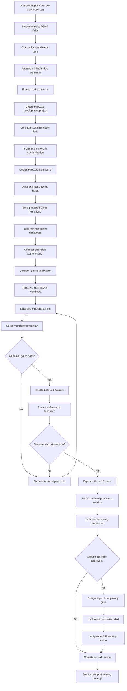

## 5. Production component architecture

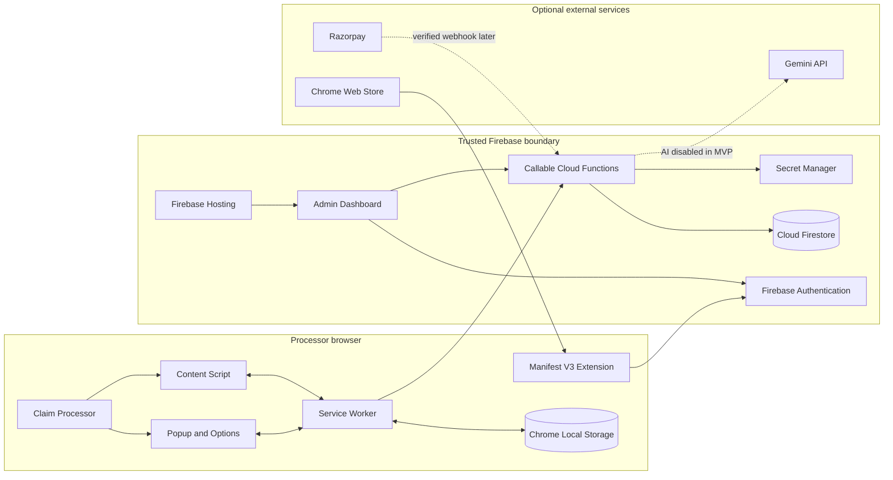

## 6. Trust boundaries and responsibility split

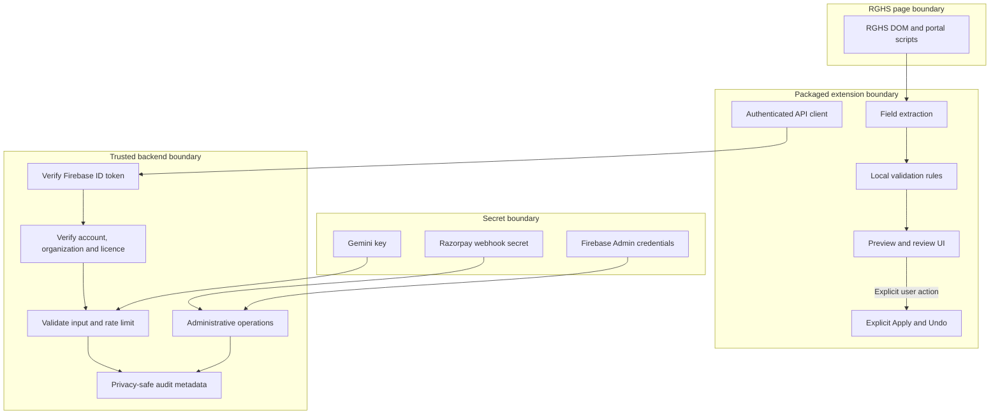

### Extension owns

- Portal-page detection and compatibility checks.
- Required-field extraction.
- Existing deterministic claim rules.
- Preview, reconciliation, decisions, Apply, Undo, and recovery.
- Authentication UI and token forwarding.
- Short-lived licence cache.
- Clear degraded/offline status.

### Cloud Functions own

- Token verification.
- Account, organization, role, and licence verification.
- Invitation acceptance and administrative mutations.
- Usage limits and rate limiting.
- Privacy-safe server audit events.
- Razorpay signature verification.
- Gemini secrets and optional AI calls.

### Firestore never owns

- Patient names.
- TIDs or claim identifiers.
- Diagnoses or treatment narratives.
- Medical documents.
- Portal remarks.
- Claim, approved, or deduction amounts.
- Raw AI prompts or responses.

## 7. Invite-only customer onboarding

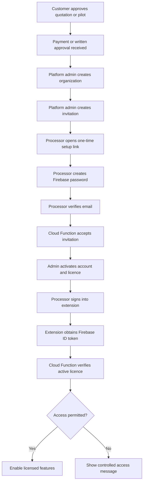

## 8. Authentication and licence state machine

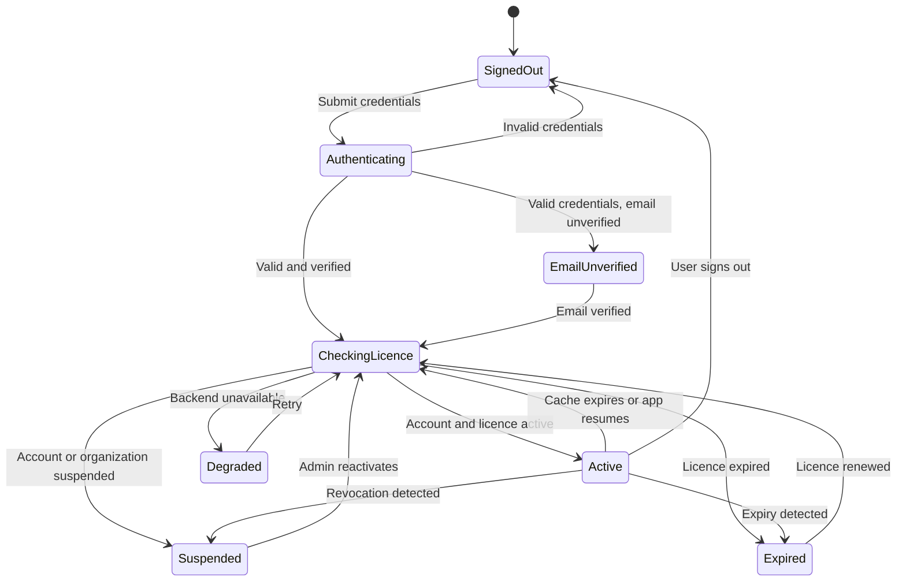

### Licence-cache rule

The cache supports brief outages; it is not an offline perpetual licence.
Duration must be decided before implementation. Expiry, suspension, and minimum
supported-version checks must use server time.

## 9. Runtime claim-processing sequence

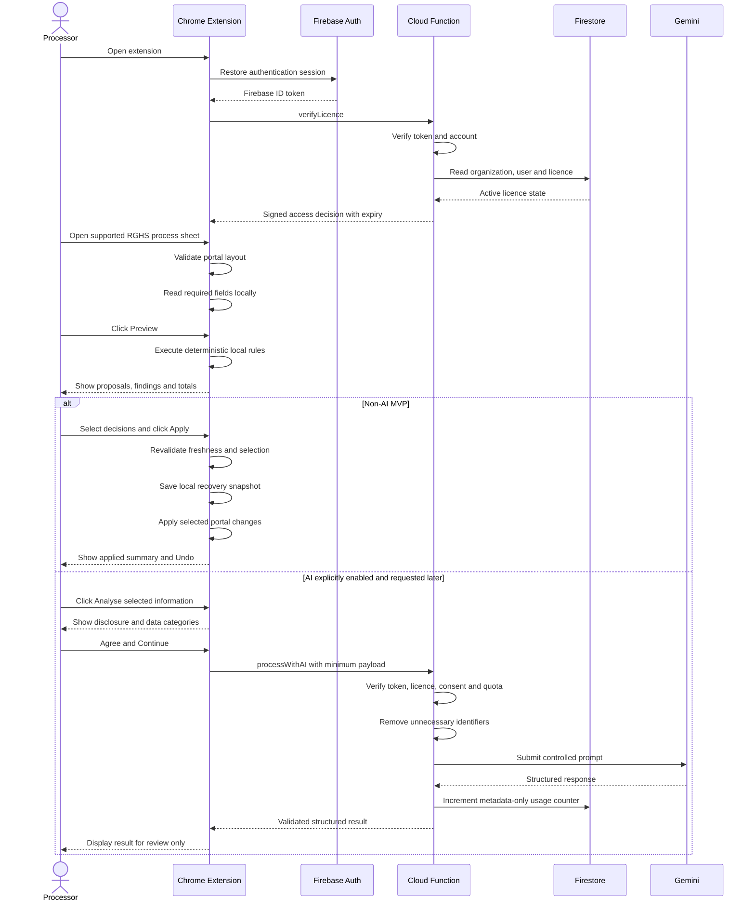

## 10. Authorization path

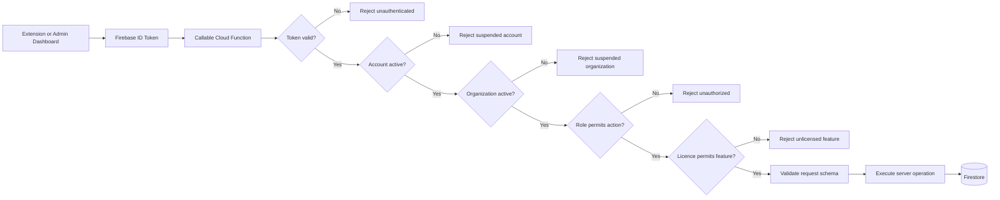

## 11. Firestore logical data model

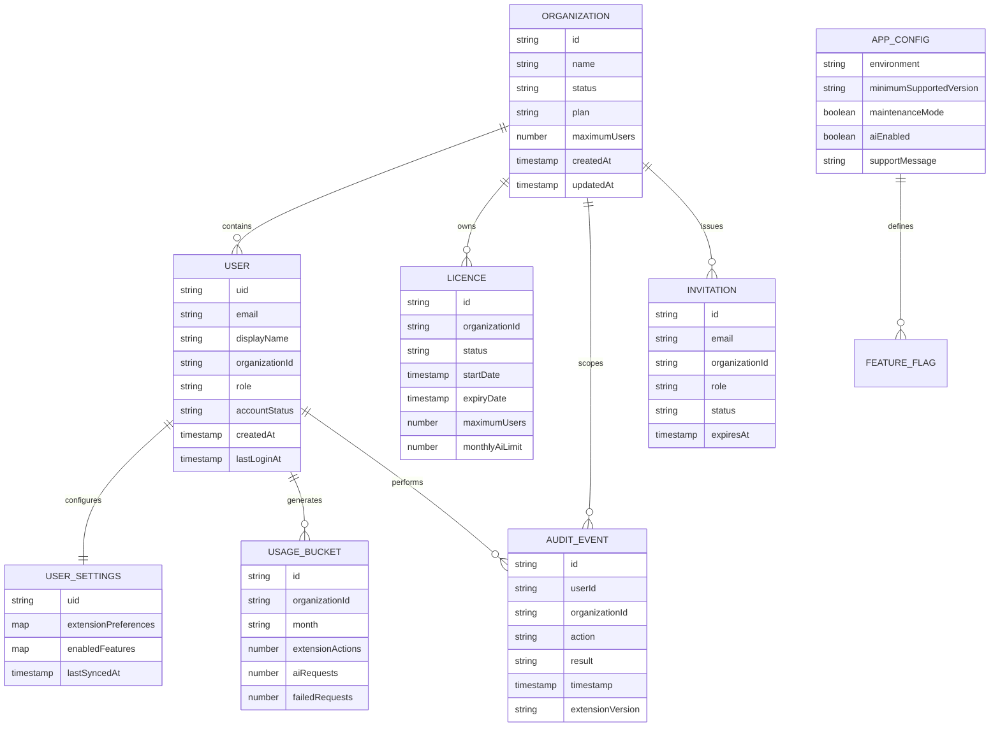

### Collection contracts

| Collection | Client access | Trusted writes | Claim content allowed |
|---|---|---|---|
| `organizations` | Processor reads limited own-org view | Cloud Functions | No |
| `users` | User reads own profile | Cloud Functions | No |
| `licences` | No direct processor read in MVP | Cloud Functions | No |
| `userSettings` | User reads/writes allowlisted own fields | User or function | No |
| `usage` | Optional own aggregate read | Cloud Functions | No |
| `auditLogs` | Admin-only query | Cloud Functions | No |
| `invitations` | Setup flow through function | Cloud Functions | No |
| `appConfig` | Authenticated read of allowlisted fields | Cloud Functions | No executable code |

## 12. Data classification and allowed destinations

| Data | Local browser | Firebase Auth | Firestore | Functions transient | Gemini |
|---|---:|---:|---:|---:|---:|
| Email and UID | Yes | Yes | Yes | Yes | No |
| Organization and role | Cached | Claims/token | Yes | Yes | No |
| Licence status | Cached briefly | No | Yes | Yes | No |
| Extension settings | Yes | No | Allowlisted | Yes | No |
| Usage counters | Optional cache | No | Yes | Yes | No |
| Patient name | Page only | No | No | No | No |
| TID or claim ID | Local recovery only | No | No | Temporary reference only | No |
| Diagnosis/treatment text | Page only | No | No | AI-only if approved later | Minimum only |
| Claim/approved amounts | Local workflow | No | No | AI-only if essential | Minimum only |
| Portal remarks | Local workflow | No | No | No by default | No by default |
| Raw AI prompt/response | No default persistence | No | No | Request lifetime only | Request processing |

## 13. Data-minimization pipeline

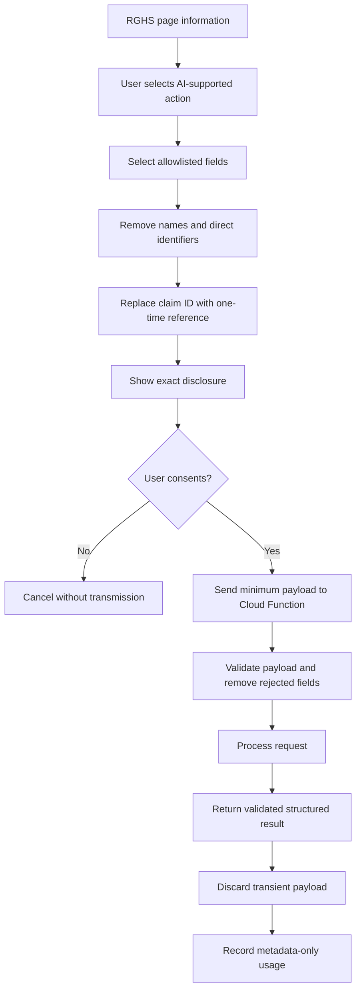

## 14. Cloud Functions catalogue

### Authentication and licences

- `acceptInvitation`
- `getCurrentUserProfile`
- `verifyLicence`
- `requestPasswordReset`
- `requestAccountDeletion`

### Platform administration

- `createOrganization`
- `updateOrganization`
- `inviteUser`
- `activateUser`
- `suspendUser`
- `activateLicence`
- `suspendLicence`
- `changeUserRole`
- `resetUserAccess`

### System

- `getExtensionConfig`
- `recordExtensionEvent`
- `reportClientError`

### Payments, later

- `recordManualPayment`
- `handleRazorpayWebhook`

### AI, later

- `processWithAI`
- `getAiUsage`
- `setAiLimit`

Every function must verify authentication, account status, organization,
role, licence, input schema, request size, rate limits, and safe logging before
performing its operation.

## 15. Manual payment and licence activation

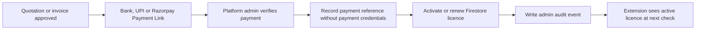

## 16. Future Razorpay webhook automation

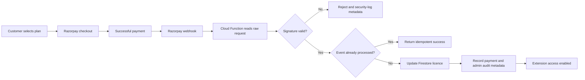

## 17. Environment architecture

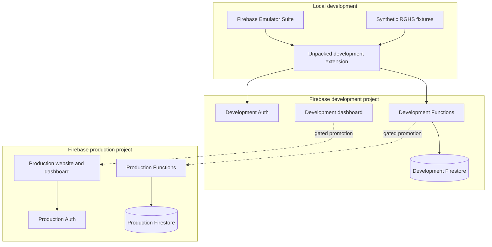

Development credentials, data, project IDs, extension IDs, and allowed origins
must not be interchangeable with production.

## 18. Failure behavior

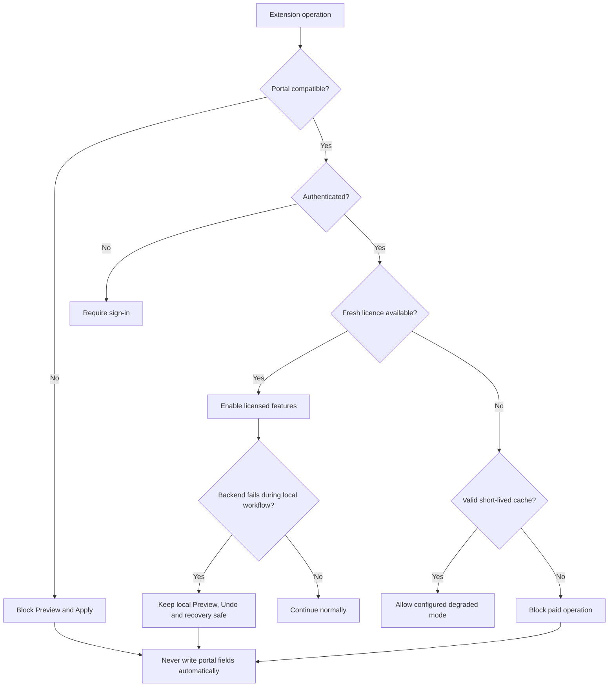

### Required safe failures

- Authentication failure: no portal write.
- Licence failure: no paid-feature write.
- Backend timeout: local recovery remains available.
- Firestore denial: controlled message, no retry storm.
- AI timeout: no partial AI result and no portal write.
- Portal layout drift: block rather than guess.
- Stale preview: require a fresh preview.

## 19. Testing architecture

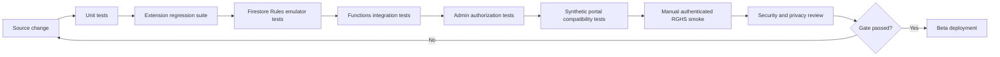

### Minimum security tests

- Cross-user profile read denied.
- Cross-organization access denied.
- Processor role cannot change role or licence.
- Expired and suspended accounts rejected.
- Invalid and replayed invitations rejected.
- Invalid Firebase token rejected.
- Oversized and unknown input fields rejected.
- Rate limits enforced.
- Razorpay signatures and idempotency verified.
- Claim content absent from Firestore, logs, analytics, and error reports.
- Admin UI prevents stored and reflected script injection.

## 20. Controlled release workflow

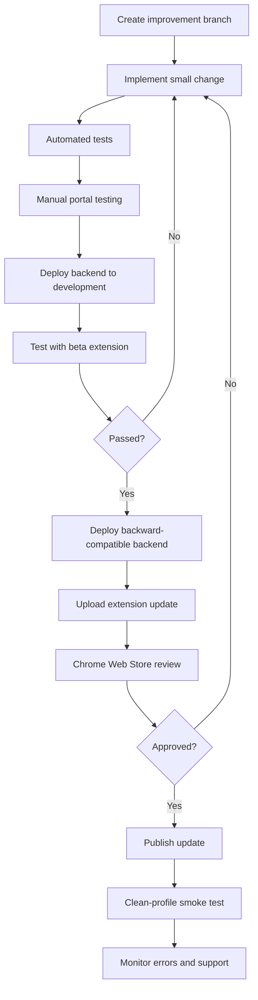

Backend changes must remain compatible with the currently published extension
until the new extension version is approved and adopted.

## 21. Pilot and production gates

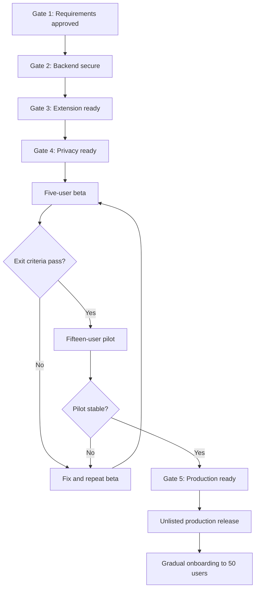

### Gate 1 — Requirements approved

- Two MVP workflows documented.
- Supported RGHS routes and fields listed.
- Local and cloud data inventory approved.
- Licence failure behavior decided.
- AI explicitly deferred.

### Gate 2 — Backend secure

- Emulator tests pass.
- Firestore rules deny unauthorized access.
- Admin mutations use Cloud Functions.
- Secrets remain server-side.
- Sensitive claim content is absent from logs and storage.

### Gate 3 — Extension ready

- Existing 100-test regression baseline remains green.
- Login survives browser restart.
- Licence checks are bounded and retry safely.
- Preview is read-only.
- Apply remains explicit and stale-safe.
- Undo and recovery work during backend failure.
- No remote executable code.

### Gate 4 — Privacy ready

- Real publisher identity.
- Monitored support and privacy contact.
- Accurate homepage, privacy, terms, support, and deletion pages.
- Dashboard answers match deployed behavior.
- Firebase subprocessors and retention disclosed.
- In-product transfer disclosure exists before any future AI request.

### Gate 5 — Production ready

- Five-user beta and 15-user pilot completed.
- Critical defects resolved.
- Production backups and restore test completed.
- Billing and cost alerts enabled.
- Support and account-deletion procedures tested.
- Clean-profile Web Store installation smoke passes.

## 22. Support and operating process

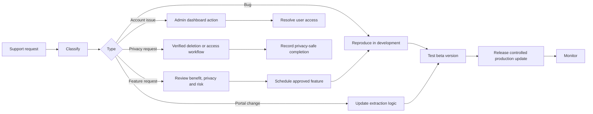

## 23. Twelve-week target schedule

| Week | Deliverable | Exit evidence |
|---|---|---|
| 1 | Requirements and data inventory | Gate 1 approved |
| 2 | Firebase projects and emulators | Isolated dev/prod configuration |
| 3 | Invitations and Authentication | Verified invite-only login tests |
| 4 | Organizations, licences, Rules | Authorization emulator tests |
| 5 | Minimal admin dashboard | Admin role tests |
| 6 | Extension authentication | Restart/session tests |
| 7 | Licence integration | Active/expired/suspended tests |
| 8 | Existing RGHS workflow integration | 100 regressions plus portal smoke |
| 9 | Usage, errors, security hardening | No-sensitive-log evidence |
| 10 | Privacy, terms and deletion | Gate 4 approved |
| 11 | Five-user beta | Recorded exit findings |
| 12 | Fixes and 15-user pilot decision | Production go/no-go |

AI and automated Razorpay subscriptions are not included in this twelve-week
MVP commitment.

## 24. Final build order

1. Approve the two existing high-value workflows as the MVP.
2. Freeze and tag the local v1.5.1 baseline.
3. Create development and production Firebase projects.
4. Configure the Local Emulator Suite.
5. Implement invite-only Authentication.
6. Implement organizations, users, invitations, and licences.
7. Write Firestore Rules and authorization tests.
8. Build trusted Cloud Functions.
9. Build the minimal admin dashboard.
10. Add extension login and session restoration.
11. Add licence verification and safe degraded behavior.
12. Preserve and revalidate local RGHS processing.
13. Add privacy-safe usage and error metadata.
14. Publish accurate privacy, terms, support, and deletion pages.
15. Complete security and privacy gates.
16. Pilot with five users.
17. Expand to fifteen users.
18. Publish an unlisted production extension.
19. Onboard remaining users gradually.
20. Evaluate Gemini and Razorpay automation as separate later phases.

## 25. Decisions required before implementation

| Decision | Required answer |
|---|---|
| Publisher identity | Legal or trading name shown publicly |
| Support | Monitored public support email |
| Firebase projects | Development and production project IDs |
| Initial organizations | One organization or multiple customers |
| Licence term | Monthly, quarterly, annual, or fixed pilot |
| Seat enforcement | Named users and maximum seats |
| Grace period | Duration and allowed degraded features |
| Data residency/legal review | Required organizational or legal constraints |
| First beta users | Five authorized processors |
| AI | Explicitly disabled for MVP unless separately approved |

## 26. Blueprint change control

Changes to authentication, cloud data, permissions, claim-field extraction,
AI processing, retention, payment handling, or administrative access require:

1. An update to this blueprint.
2. A data-inventory review.
3. Updated automated security tests.
4. Privacy-policy and Chrome Dashboard consistency review.
5. A beta release before production.
